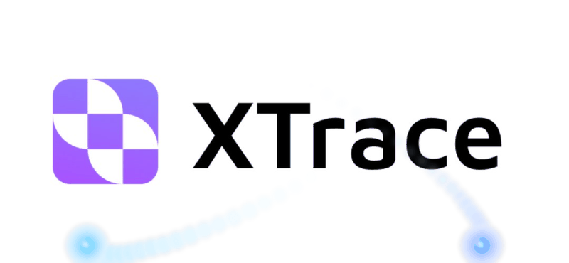

<div align="center">

<!-- Replace with your banner gif once added to assets/ -->


<p><strong> The encrypted vector database.<br>Your data never leaves your machine in plaintext. </strong></p>

<p>
  <a href="https://pypi.org/project/xtrace-ai-sdk/"></a>
  <a href="https://github.com/XTraceAI/xtrace-sdk/blob/main/LICENSE"></a>
  <a href="https://www.python.org/downloads/"></a>
  <a href="https://docs.xtrace.ai"></a>
</p>

<h4>
  <a href="https://docs.xtrace.ai">Documentation</a> |
  <a href="https://x.com/XTrace_ai">X</a> |
  <a href="https://www.linkedin.com/company/xtrace-ai/">LinkedIn</a>
</h4> 
<sub>Manage your AI memory &rarr; <a href="https://mem.xtrace.ai">mem.xtrace.ai</a></sub>
</div>

---

# What is XTrace?

Every vector database on the market requires you to hand your data to a third party in plaintext. XTrace doesn't. Your documents and embedding vectors are encrypted **on your machine** before anything is transmitted. The server stores and searches over ciphertexts — it computes nearest-neighbor results without ever seeing the plaintext. Your data stays yours, even during search.

The SDK has two modules:

- **x-vec** — encrypted vector search. Store and query text chunks with end-to-end encryption.
- **x-mem** — encrypted agent memory for AI agents (coming soon).

## How It Works

```
    Your Machine                              XTrace Server
┌────────────────────────┐                ┌─────────────────────────┐
│                        │                │                         │
│  Documents + Queries   │                │  Stores only ciphertext │
│         │              │                │                         │
│         ▼              │                │  Searches over          │
│  Embed + Encrypt       │── ciphertext ─▶│  encrypted vectors      │
│  (keys stay here)      │                │  (never decrypts)       │
│         ▲              │                │                         │
│         │              │◀─ ciphertext ──│  Returns encrypted      │
│  Decrypt results       │                │  results                │
│                        │                │                         │
└────────────────────────┘                └─────────────────────────┘
  Secret key never leaves                   Zero knowledge
```
XTrace encrypts everything on your machine before anything touches the network. Your content is embedded locally with a model of your choice, and both the resulting vectors and the raw text are encrypted with Paillier homomorphic encryption and AES-256, respectively. The server only ever stores and operates on ciphertexts. When you search, your query is encrypted the same way. The secret key never leaves your environment, and the server never sees a single byte of plaintext. [Verify the encryption](#verify-the-encryption)

# Quick Start

> [!TIP]
> 🚀 **Create a free account at [app.xtrace.ai](https://app.xtrace.ai)** to get your API key and org ID. The free tier is rate-limited but fully functional.


## Install

```bash
# Base SDK
uv pip install xtrace-ai-sdk

# With local embedding support (Sentence Transformers)
uv pip install "xtrace-ai-sdk[embedding]"
```

Requires Python 3.11+.

## Documentation

Full documentation at [docs.xtrace.ai](https://docs.xtrace.ai), or build locally:

```bash
cd docs && make html
```

## CLI

The fastest way to go from zero to search results:

```bash
uv pip install "xtrace-ai-sdk[cli]"

xtrace init                                    # set up credentials + encryption keys
xtrace kb create my-first-kb                   # create a knowledge base (note the KB ID)
xtrace xvec load ./my-docs/ <KB_ID>            # encrypt and upload documents
xtrace xvec retrieve <KB_ID> "your query"      # search
```

## Python SDK

Full async example:

```python
import asyncio
from xtrace_sdk.x_vec.utils.execution_context import ExecutionContext
from xtrace_sdk.x_vec.crypto.key_provider import PassphraseKeyProvider
from xtrace_sdk.x_vec.data_loaders.loader import DataLoader
from xtrace_sdk.x_vec.inference.embedding import Embedding
from xtrace_sdk.integrations.xtrace import XTraceIntegration
from xtrace_sdk.x_vec.retrievers.retriever import Retriever

# One-time setup: generate your private cryptographic state and save it
provider = PassphraseKeyProvider("your-secret-passphrase")
ctx = ExecutionContext.create(
    key_provider=provider,
    homomorphic_client_type="paillier_lookup",
    embedding_length=512,
    key_len=1024,
    path="data/exec_context",
)

embed  = Embedding("sentence_transformer", "mixedbread-ai/mxbai-embed-large-v1", 512)
xtrace = XTraceIntegration(org_id="your_org_id", api_key="your_api_key")

async def main():
    # Encrypt and store documents — content and vectors never leave in plaintext
    loader = DataLoader(ctx, xtrace)
    docs   = [{"chunk_content": "XTrace encrypts your embeddings.", "meta_data": {}}]
    vectors = [await embed.bin_embed(d["chunk_content"]) for d in docs]
    index, db = await loader.load_data_from_memory(docs, vectors)
    await loader.dump_db(db, index=index, kb_id="your_kb_id")

    # Query with an encrypted vector — the server never sees the query in plaintext
    retriever = Retriever(ctx, xtrace)
    vec     = await embed.bin_embed("How does XTrace protect my data?")
    ids     = await retriever.nn_search_for_ids(vec, k=3, kb_id="your_kb_id")
    results = await retriever.retrieve_and_decrypt(ids, kb_id="your_kb_id")
    for r in results:
        print(r["chunk_content"])

asyncio.run(main())
```

## Verify the Encryption

This repo exists so you can verify the encryption yourself. The tests run fully offline and require no XTrace account:

```bash
uv pip install -e ".[dev]"
pytest tests/x_vec/
```

`test_paillier_encryption.py` and `test_paillier_lookup_encryption.py` verify encrypt/decrypt round-trips and homomorphic addition on ciphertexts — the same primitives the SDK uses when sending data to XTrace. The secret key never leaves your machine.

# Contributing

We welcome contributions. See [CONTRIBUTING.md](CONTRIBUTING.md) for guidelines.

# License

Apache 2.0 — see [LICENSE](LICENSE).
